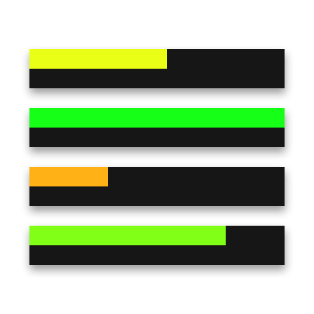

# microDurability

**microDurability** is a minimal durability viewer that shows the durability bars of your armor right above the hotbar, without wasting any space. It can also warn you when your tools or armor are about to break.
